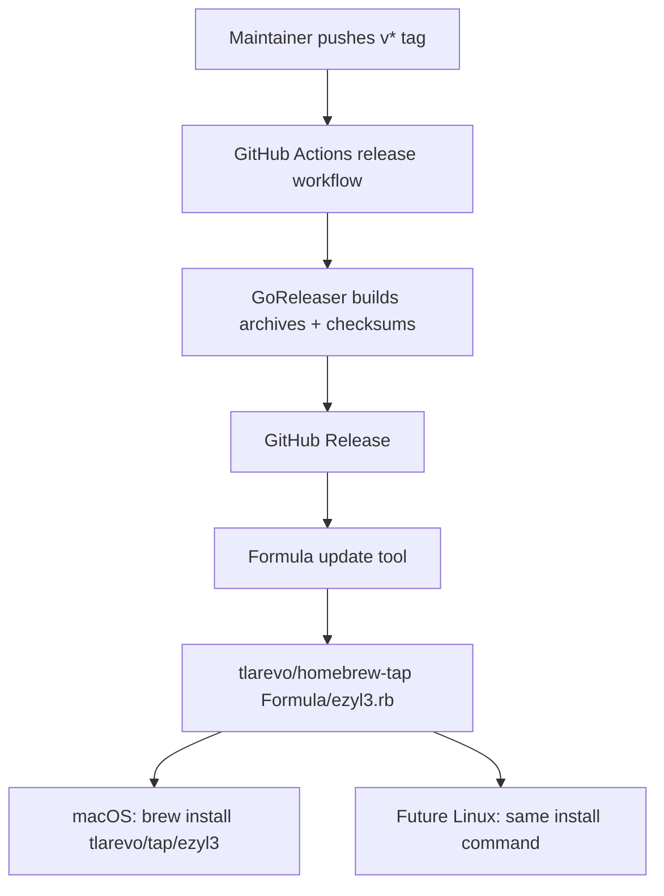

# Universal Brew Delivery Plan

## Goal

Make `ezyl3` installable as a universal CLI/TUI through Homebrew without using a
macOS-cask-shaped delivery model or GoReleaser's deprecated formula publisher.

The intended user-facing install command is:

```bash
brew install tlarevo/tap/ezyl3
```

## Context

Review of PR #10 exposed a delivery mismatch. `ezyl3` is currently a CLI/TUI,
not a macOS `.app`, `.pkg`, or `.dmg`. The project should target macOS first,
but the delivery model should also make sense for future Linux and server
deployments.

GoReleaser's old Homebrew formula integration (`brews`) is deprecated, so using
it would make the release foundation stale from day one. GoReleaser's maintained
replacement (`homebrew_casks`) is cask-shaped, which pulls the project toward a
macOS app distribution model and signing/notarization concerns that do not fit a
universal CLI/TUI.

The right split is:

- GoReleaser builds release artifacts and checksums.
- A repository-owned tap update step publishes a Homebrew formula.
- Cask packaging stays out of scope while the product is CLI/TUI-only.

## Decision

Use a Homebrew **formula** as the product package model.

Do not use GoReleaser `brews`.

Do not use GoReleaser `homebrew_casks` for this CLI/TUI release path.

Add a small, tested tap update tool that renders `Formula/ezyl3.rb` in
`tlarevo/homebrew-tap` from GoReleaser output.

For the first release, the formula can target macOS only because the runtime and
service management are macOS-only today. The formula should still be structured
so Linux assets can be added later without changing the install command.

## Architecture



## Requirements

1. `brew install tlarevo/tap/ezyl3` installs the CLI/TUI without requiring Go or a
   source checkout.
2. `brew upgrade ezyl3` moves users to the latest released binary.
3. GoReleaser remains responsible for release artifacts, checksums, changelog,
   and GitHub Release creation.
4. Formula publishing is handled outside GoReleaser's deprecated `brews`
   integration.
5. Cask publishing is not used while `ezyl3` is only a CLI/TUI.
6. The formula is generated from a repository-owned template so the package
   definition is reviewable.
7. Release automation fails if any required artifact or checksum is missing.
8. README install guidance leads with Homebrew, with source build documented as a
   developer path.
9. Local testing documentation explains when to use direct Go commands,
   GoReleaser snapshots, local formula installs, and the real tap.
10. Uninstall attempts `launchctl bootout` for every planned service before
   deleting its plist, even when only one service plist exists.
11. The first implementation must not claim Linux runtime support before Linux
    service/runtime work exists.

## Files

- `.goreleaser.yaml`: keep artifact generation; remove `homebrew_casks`; do not
  add `brews`.
- `.github/workflows/release.yml`: run GoReleaser, then render and push the tap
  formula.
- `scripts/update-homebrew-formula/main.go`: parse checksums and render formula
  data.
- `scripts/update-homebrew-formula/main_test.go`: test checksum parsing,
  required artifact validation, and formula rendering.
- `scripts/templates/ezyl3.rb.tmpl`: Homebrew formula template.
- `internal/core/service.go`: add a service-level stop helper used by uninstall.
- `internal/core/service_test.go`: test service-level bootout behavior.
- `internal/cli/root.go`: use planned service list when uninstalling.
- `internal/cli/root_test.go`: cover partial service plans during uninstall.
- `README.md`: lead with formula install and document release prerequisites plus
  the local testing ladder.

## Implementation Plan

### Task 1: Keep GoReleaser Artifact-Only

Remove any `homebrew_casks` block from `.goreleaser.yaml`. Do not add a `brews`
block.

The release config should retain:

```yaml
checksum:
  name_template: "checksums.txt"

changelog:
  sort: asc
  filters:
    exclude:
      - "^docs:"
      - "^test:"
      - "^chore:"

release:
  github:
    owner: tlarevo
    name: ezyl3
```

Validate:

```bash
goreleaser check
```

Expected: passes without a deprecated Homebrew formula publisher warning.

Commit:

```bash
git add .goreleaser.yaml
git commit -m "ci: keep goreleaser focused on release artifacts"
```

### Task 2: Add Formula Rendering Tool

Create `scripts/update-homebrew-formula/main.go`.

The tool should:

- accept `--tag`, `--checksums`, `--template`, and `--output`;
- parse GoReleaser checksum output;
- require `ezyl3_<version>_darwin_amd64.tar.gz`;
- require `ezyl3_<version>_darwin_arm64.tar.gz`;
- fail on duplicate checksum entries;
- render the formula template to the requested output path.

Core data shape:

```go
type formulaData struct {
	Version     string
	RepoOwner   string
	RepoName    string
	AMD64URL    string
	AMD64SHA256 string
	ARM64URL    string
	ARM64SHA256 string
}
```

Required tests in `scripts/update-homebrew-formula/main_test.go`:

- checksum parser reads both macOS archive checksums;
- duplicate archive entries fail;
- missing `darwin_amd64` fails;
- missing `darwin_arm64` fails;
- rendered formula includes version, both URLs, both SHA-256 values, and
  `bin.install "ezyl3"`.

Formula template path:

```text
scripts/templates/ezyl3.rb.tmpl
```

Template:

```ruby
class Ezyl3 < Formula
  desc "Manage a local LiteLLM bridge for Cursor"
  homepage "https://github.com/{{ .RepoOwner }}/{{ .RepoName }}"
  version "{{ .Version }}"
  license "MIT"

  on_macos do
    on_arm do
      url "{{ .ARM64URL }}"
      sha256 "{{ .ARM64SHA256 }}"
    end

    on_intel do
      url "{{ .AMD64URL }}"
      sha256 "{{ .AMD64SHA256 }}"
    end
  end

  def install
    bin.install "ezyl3"
  end

  test do
    assert_match version.to_s, shell_output("#{bin}/ezyl3 version")
  end
end
```

Validate:

```bash
go test ./scripts/update-homebrew-formula
```

Commit:

```bash
git add scripts/update-homebrew-formula scripts/templates/ezyl3.rb.tmpl
git commit -m "ci: add homebrew formula renderer"
```

### Task 3: Publish Formula After GoReleaser

After the GoReleaser release step in `.github/workflows/release.yml`, check out
the tap repository, render the formula, then commit and push `Formula/ezyl3.rb`.

Workflow shape:

```yaml
      - name: Check out Homebrew tap
        uses: actions/checkout@34e114876b0b11c390a56381ad16ebd13914f8d5 # v4.3.1
        with:
          repository: tlarevo/homebrew-tap
          token: ${{ secrets.HOMEBREW_TAP_TOKEN }}
          path: homebrew-tap
          persist-credentials: true

      - name: Render Homebrew formula
        run: |
          go run ./scripts/update-homebrew-formula \
            --tag "${GITHUB_REF_NAME}" \
            --checksums dist/checksums.txt \
            --template scripts/templates/ezyl3.rb.tmpl \
            --output homebrew-tap/Formula/ezyl3.rb

      - name: Publish Homebrew formula
        working-directory: homebrew-tap
        run: |
          git config user.name "github-actions[bot]"
          git config user.email "41898282+github-actions[bot]@users.noreply.github.com"
          git add Formula/ezyl3.rb
          git commit -m "ezyl3 ${GITHUB_REF_NAME}" || exit 0
          git push
```

`HOMEBREW_TAP_TOKEN` must have contents write access to `tlarevo/homebrew-tap`.

Validate:

```bash
go test ./scripts/update-homebrew-formula
goreleaser check
```

Commit:

```bash
git add .github/workflows/release.yml
git commit -m "ci: publish formula after goreleaser artifacts"
```

### Task 4: Fix Uninstall Service Bootout Ordering

Add a service-level stop helper so uninstall can boot out only the services in
`core.UninstallPlan.Services`.

Expected production behavior:

- if only `litellm` has a plist, uninstall attempts `litellm` bootout;
- if only `ngrok` has a plist, uninstall attempts `ngrok` bootout;
- if both have plists, uninstall attempts both;
- plist removal happens after these attempts.

Implementation direction:

```go
func (m ServiceManager) StopServices(services []string) ([]ServiceActionResult, error) {
	return m.runServices("stop", services)
}
```

`runServices` should use the same `launchctl bootout` arguments as normal
`service stop`. Preserve existing optional-ngrok behavior for regular service
commands.

Change uninstall from all-or-nothing stop:

```go
manager := newServiceManager(paths)
if _, stopErr := manager.Stop(); stopErr != nil {
	_, _ = fmt.Fprintf(out, "Note: stopping services reported: %v\n", stopErr)
}
```

to planned service stop:

```go
manager := newServiceManager(paths)
if len(plan.Services) > 0 {
	if _, stopErr := manager.StopServices(plan.Services); stopErr != nil {
		_, _ = fmt.Fprintf(out, "Note: stopping services reported: %v\n", stopErr)
	}
}
```

Validate:

```bash
go test ./internal/core ./internal/cli -run 'TestServiceManagerStopServices|TestUninstall'
```

Commit:

```bash
git add internal/core/service.go internal/core/service_test.go internal/cli/root.go internal/cli/root_test.go
git commit -m "fix: boot out planned services during uninstall"
```

### Task 5: Update README Install Guidance

Move Homebrew install before source-build instructions.

The first install section should contain:

- heading: `## Install`;
- command: `brew install tlarevo/tap/ezyl3`;
- note: released binaries report their tag with `ezyl3 version`;
- next source-focused heading: `## Build From Source`.

Add maintainer release notes:

```markdown
## Releasing

Tagged releases use GoReleaser for GitHub artifacts and a separate formula
rendering step for `tlarevo/homebrew-tap`. The repository secret
`HOMEBREW_TAP_TOKEN` must have contents write access to the tap repository.
```

Add a local testing section that explains Brew is for packaging/release
validation, not the normal development loop:

- Heading: `## Local Testing`
- Principle: direct Go commands are the normal development loop; Brew is only for
  package/release validation.
- Day-to-day commands: `go test ./...`, `go run ./cmd/ezyl3 --help`,
  `go run ./cmd/ezyl3 version`, `go build -o /tmp/ezyl3 ./cmd/ezyl3`, and
  `/tmp/ezyl3 version`.
- Snapshot artifact commands: `goreleaser release --snapshot --clean
  --skip=publish` and `find dist -type f -name ezyl3 -perm +111`.
- Isolated smoke-test pattern: run the built binary with temporary `HOME`,
  `XDG_DATA_HOME`, `XDG_STATE_HOME`, `XDG_CONFIG_HOME`, and `XDG_CACHE_HOME`
  values under `/tmp/ezyl3-smoke` so checks do not touch real profiles.
- Local formula validation commands: `brew install --formula ./Formula/ezyl3.rb`,
  `ezyl3 version`, and `brew uninstall ezyl3`.
- Public release validation commands: `brew tap tlarevo/tap`,
  `brew install tlarevo/tap/ezyl3`, `ezyl3 version`, and
  `brew uninstall ezyl3`.

Commit:

```bash
git add README.md
git commit -m "docs: lead with brew formula install"
```

### Task 6: Final Verification

Run:

```bash
go test ./...
goreleaser check
goreleaser release --snapshot --clean --skip=publish
git diff --check
git diff --stat
```

Expected:

- tests pass;
- GoReleaser config validates;
- snapshot release artifacts are produced locally;
- no deprecated `brews` warning;
- no `homebrew_casks` release publishing;
- diff is limited to the files in this plan.

## Out of Scope

- GoReleaser `brews`.
- Homebrew cask packaging for the CLI/TUI.
- macOS `.app`, `.dmg`, `.pkg`, notarization, or menu bar distribution.
- Linux runtime or service-manager implementation.
- Publishing to Homebrew core.
- Package managers other than Homebrew.

## Notes

This plan follows PR #10. It can land after PR #10 merges, or it can be applied
directly to PR #10's branch before merge.

If GoReleaser later adds a non-deprecated formula integration, the automation can
be revisited while keeping the formula-first package model.

If `ezyl3` later gains a macOS app wrapper, a cask can be added as a second
distribution channel without replacing the formula.
