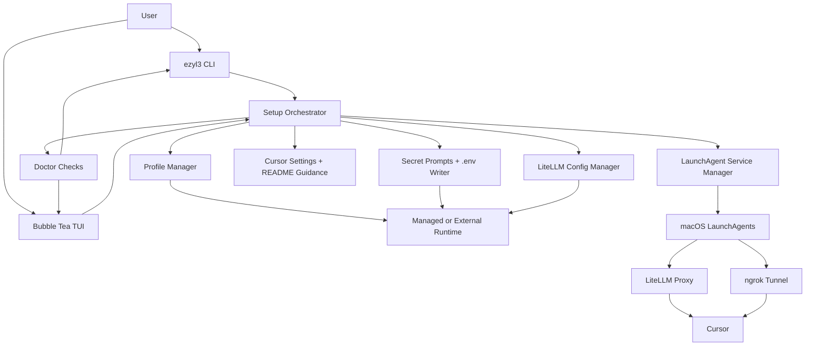

# Setup Polish PRD

## Problem Statement

`ezyl3` has a working first slice for creating and managing a LiteLLM bridge for Cursor, but the setup path is still too sharp-edged for everyday use. A user can create profiles, inspect doctor checks, import an existing runtime, print Cursor settings, edit configured model tiers, manage LaunchAgents, and read logs. However, the most sensitive workflow, initial setup, is still flag-driven and can encourage secrets in shell history. Service lifecycle behavior is functional but thinly wrapped around `launchctl`, which makes failure handling and testing harder than the product needs. The Bubble Tea TUI is currently a dashboard only, so a user still needs to know which commands to run next when setup is incomplete.

The next phase should turn the current command set into a confident setup experience. A user should be able to install or import a runtime, enter secrets safely, understand service state, validate model tiers, see what Cursor needs, and recover from common setup failures without reading source code or leaking credentials.

## Solution

Build a setup-polish phase around one user outcome: a macOS user can get from "I have `ezyl3` installed" to "Cursor is pointed at a healthy LiteLLM bridge" with clear prompts, safe secret handling, reliable service feedback, and enough TUI guidance to avoid command memorization.

The CLI remains the automation surface. `ezyl3 setup` becomes interactive by default while preserving explicit flags for scripted use. The TUI becomes a setup-oriented control surface with views for setup progress, profile/import status, service state, model summary, doctor checks, and logs. Side-effectful operations, especially `launchctl` and log following, move behind narrow interfaces so they can be tested without invoking system services.

The phase also adds user-facing README/install documentation. This is not a packaging or release automation phase; it should document how to build and run the tool from source, how managed profiles are laid out, how Cursor should be configured, and how to avoid exposing secrets.

## Architecture

## User Stories

1. As a Cursor user, I want `ezyl3 setup` to guide me through setup interactively, so that I do not need to learn every flag before creating a working runtime.
2. As a Cursor user, I want setup to ask for secrets through non-echoing prompts, so that API keys are not exposed in shell history or terminal output.
3. As a Cursor user, I want setup to generate a LiteLLM master key when I do not provide one, so that I can finish setup without inventing a credential format.
4. As a Cursor user, I want setup to confirm before overwriting an existing managed profile, so that I do not accidentally destroy a working bridge.
5. As a Cursor user, I want setup to show where profile files, logs, and LaunchAgents were written, so that I can inspect or remove them later.
6. As a Cursor user, I want setup to validate my ngrok domain before writing service files, so that an invalid tunnel name fails early.
7. As a Cursor user, I want setup to explain when ngrok is optional, so that I can choose local-only setup when I do not need a public tunnel.
8. As a Cursor user, I want setup to preserve flag-based operation, so that I can automate profile creation in scripts.
9. As a Cursor user, I want scripted setup to avoid printing secret values, so that CI logs and shell transcripts stay safe.
10. As a Cursor user, I want setup to summarize Cursor base URL and model names after creation, so that I can paste the right settings into Cursor.
11. As a Cursor user with an existing LiteLLM runtime, I want import to be visible in the TUI, so that I can connect `ezyl3` to my current setup without migrating files.
12. As a Cursor user with an external profile, I want the product to make external profiles visibly read-only for installation steps, so that I know `ezyl3` will not mutate my existing runtime.
13. As a Cursor user, I want the TUI to show setup progress and missing requirements, so that I can tell what remains before the bridge is usable.
14. As a Cursor user, I want the TUI to show doctor checks with concise remediation text, so that failures are actionable.
15. As a Cursor user, I want the TUI to refresh doctor state without restarting, so that I can check fixes as I make them.
16. As a Cursor user, I want the TUI to show current profile mode, runtime path, port, and tunnel provider, so that I know which bridge I am managing.
17. As a Cursor user, I want the TUI to show service status for LiteLLM and ngrok, so that I can understand whether the bridge is running.
18. As a Cursor user, I want the TUI to offer service start, stop, and restart actions, so that I can recover without switching back to separate commands.
19. As a Cursor user, I want service commands to report missing LaunchAgent files clearly, so that I know whether setup needs to run first.
20. As a Cursor user, I want service commands to handle optional ngrok gracefully, so that a local-only profile does not fail because no ngrok LaunchAgent exists.
21. As a Cursor user, I want service status to distinguish loaded, running, stopped, and unknown states, so that I can choose the right recovery action.
22. As a Cursor user, I want launchctl errors to be wrapped with the service name and attempted action, so that I can troubleshoot service failures.
23. As a Cursor user, I want the TUI to show configured model tiers and fallbacks, so that I can verify Cursor model names map to the providers I expect.
24. As a Cursor user, I want model validation errors to identify the missing or broken tier, so that I can fix only the relevant model entry.
25. As a Cursor user, I want logs to be available from the CLI and TUI, so that I can inspect LiteLLM and ngrok failures quickly.
26. As a Cursor user, I want log following to be cancellable from the product, so that I do not leave a stuck `tail -f` process behind.
27. As a Cursor user, I want doctor output to avoid noisy local filesystem and HTTP internals when possible, so that the health report is readable.
28. As a Cursor user, I want doctor JSON to remain available, so that automation can inspect setup state.
29. As a Cursor user, I want README instructions for building and running from source, so that I can install the current project without guessing.
30. As a Cursor user, I want README guidance for managed versus external profiles, so that I can decide whether to import or create a runtime.
31. As a Cursor user, I want README guidance for secrets and redaction guarantees, so that I understand what the tool will and will not print.
32. As a Cursor user, I want README troubleshooting for service startup, ngrok, LiteLLM health, and Cursor settings, so that common failures are recoverable.
33. As a developer, I want setup orchestration separated from Cobra command wiring, so that interactive setup can be tested independently of terminal argument parsing.
34. As a developer, I want service execution behind an injectable runner, so that service behavior can be unit tested without calling `launchctl`.
35. As a developer, I want log reading and following behind a narrow interface, so that log behavior can be tested without spawning `tail`.
36. As a developer, I want the TUI to consume existing core reports and setup state models, so that UI work does not duplicate business logic.
37. As a developer, I want tests to assert secret redaction across setup, doctor, Cursor settings, and errors, so that future changes do not leak credentials.
38. As a developer, I want the setup phase to avoid changing the existing external LiteLLM runtime, so that tests and live usage do not damage user data.

## Implementation Decisions

- Keep `ezyl3` as a Go CLI plus Bubble Tea TUI. Do not add a separate installer script for this phase.
- Introduce a setup orchestrator that owns the workflow for managed profile creation, optional ngrok configuration, Python dependency installation, LaunchAgent writing, and post-setup doctor summary. Cobra should collect inputs and delegate to this orchestrator.
- Make `ezyl3 setup` interactive when required inputs are absent and stdin is a terminal. Preserve flags for non-interactive use. In non-interactive mode, missing required choices should fail with clear instructions rather than blocking for prompts.
- Move default secret collection to hidden prompts. Keep existing secret flags only for explicit scripted use, and document that prompt mode is safer.
- Treat generated master keys as default behavior. Never print the generated key; report only that it was written.
- Require overwrite confirmation for existing managed profile files unless a scripted force flag is explicitly supplied.
- Keep external profile import metadata-only. Imported runtime files must not be rewritten by setup, service bootstrap, model editing, or documentation generation unless the user explicitly runs a command that targets the external runtime path.
- Add a service manager boundary with operations for start, stop, restart, and status. The production implementation uses `launchctl`; tests use a fake runner.
- Model service status as product state rather than raw command output. The UI and CLI should show service labels, loaded/running state when known, and the action attempted when errors occur.
- Handle local-only profiles as a first-class setup outcome. If no ngrok domain exists, ngrok service operations should be skipped or reported as not configured rather than treated as a product failure.
- Replace direct `tail -f` command ownership with a log reader/follower boundary. The CLI can still stream logs, but cancellation and tests should not depend on shelling out to `tail`.
- Expand the TUI as a setup companion, not a complete administration console. The expected views are setup overview, profile/import status, service status/actions, model summary/validation, doctor checks, and logs.
- Keep model editing simple in this phase. The TUI may show model tiers and validation state, but complex multi-provider model editing can remain CLI-first unless it is needed to complete setup.
- Improve doctor messages for setup use. Preserve JSON output shape compatibility where practical, but make human output more actionable and less noisy.
- Add README documentation for build/run, setup, import, Cursor settings, services, logs, troubleshooting, and secret handling.
- Do not introduce packaging, Homebrew formula work, auto-update, non-macOS service management, additional tunnel providers, or a web UI in this phase.

## Testing Decisions

- Tests should assert external behavior and user-visible outcomes, not private function ordering.
- Add unit tests for setup orchestration using temp directories, fake prompt input, fake Python dependency installation, and fake service writing. These tests should verify created files, permissions, overwrite behavior, local-only setup, ngrok setup, and redaction.
- Add CLI tests for interactive versus scripted setup behavior, including missing non-interactive inputs, generated master key reporting, and no secret leakage in stdout/stderr.
- Add service manager tests with a fake runner covering start, stop, restart, status, missing LaunchAgent files, optional ngrok, and wrapped error messages.
- Add log reader/follower tests using temp log files and cancellable contexts instead of spawning `tail`.
- Add TUI model tests at the state/update layer for navigation, refresh, selected profile display, setup state rendering, and service action messages. Do not snapshot terminal styling unless a small golden test is demonstrably useful.
- Keep existing config, profile, ngrok, secret, and CLI tests. Extend them only where setup-polish behavior touches the same public surface.
- Run `/opt/homebrew/bin/go test ./...` as the required verification command for this phase.
- For live checks against local LiteLLM or ngrok, treat network/service probing as optional manual verification because sandbox permissions may block localhost or public tunnel access.

## Out of Scope

- Shipping a standalone `setup.sh`, `install.sh`, Homebrew formula, binary release pipeline, notarization, or updater.
- Supporting Windows or Linux service managers.
- Supporting tunnel providers other than ngrok.
- Building a web dashboard.
- Automatically editing Cursor settings files.
- Printing or exporting secret values for convenience.
- Migrating or rewriting the existing external runtime at `/Users/tharinduabeydeera/litellm-cursor`.
- Replacing LiteLLM, ngrok, Cobra, Bubble Tea, or the XDG-style managed profile layout.

## Further Notes

- The repository is currently on a clean `main` baseline with the first Go implementation committed.
- The previous handoff at `/private/tmp/ezyl3-handoff.md` is useful context, but it contains stale git-state notes from before the initial commit. The source is now tracked.
- The GitHub connector has access to `tlarevo/ezyl3`; local `gh` authentication may still be invalid, so draft PR creation should prefer the connector after the branch is pushed.
- This PRD intentionally avoids recording live ngrok domains, API keys, or values copied from profile `.env` files.
