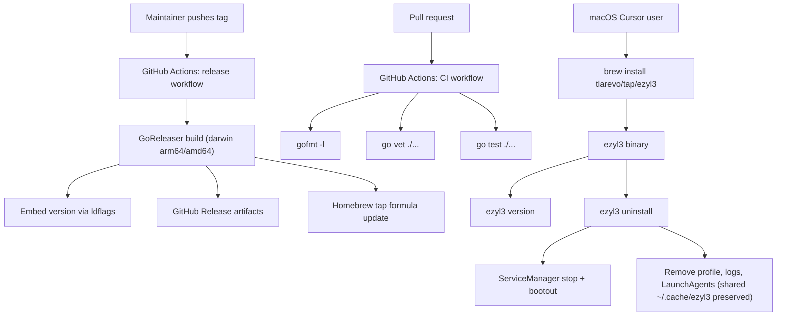

# Release and Lifecycle PRD

## Problem Statement

`ezyl3` is feature-complete for its first job: a macOS user can create or import a
LiteLLM bridge, manage services, inspect usage, and point Cursor at it. The
setup-polish phase made the tool good *once you are inside it*. The tool is still
hard to *reach*, impossible to *cleanly remove*, and hard to *diagnose* in the
field.

Concretely:

- The only install path is "clone the repo, install Go 1.24, `go build`." That is
  a developer chore, not a product. Most Cursor users will not do it.
- `setup` writes LaunchAgents, profile directories, logs, and a uv/Python cache,
  but there is no command to remove any of it. A user who tries the tool and
  changes their mind is left with orphaned `launchctl` agents still running.
- There is no `version` command and no build version embedded in the binary, so a
  bug report cannot be tied to a build.
- There is no CI. The repository has 70+ tests that never run on a pull request,
  and nothing enforces `gofmt`, `go vet`, or `go test`.
- There is no `LICENSE`, which blocks public distribution.
- The product advertises a Cursor model name, `litellm-auto`, in the README and in
  the setup summary, but that model tier is never created. A user who pastes it
  into Cursor gets a model-not-found error on first request.

The next phase should make `ezyl3` reachable, reversible, diagnosable, and correct
on first contact, so that a Cursor user can install it, try it, and back out of it
without reading source code.

## Solution

Ship a "release and lifecycle" phase built around one user outcome: a macOS Cursor
user can install `ezyl3` with one command, get a working bridge, learn which
version they are running, and completely remove the tool and everything it created
when they are done.

The distribution path for this phase is an **unsigned Homebrew tap**. Homebrew
installs CLI binaries without the browser quarantine attribute that triggers
Gatekeeper, so unsigned binaries delivered through `brew install` run cleanly for
our developer-facing audience. Apple notarization and browser-downloadable
installers are explicitly deferred to a later phase and are not required to ship
this one.

Releases are produced by a tagged GitHub Actions workflow using GoReleaser, which
builds darwin arm64 and amd64 binaries, embeds the version, publishes a GitHub
Release, and updates the Homebrew tap formula. A separate CI workflow runs
`gofmt`, `go vet`, and `go test ./...` on every pull request to protect the
existing test suite.

Lifecycle commands round out the user-facing surface: `ezyl3 version` reports the
embedded build version, and `ezyl3 uninstall` stops services, removes
LaunchAgents, and removes the managed profile and its caches with confirmation and
a dry-run preview.

The phase also fixes the `litellm-auto` inconsistency so that every model name the
product tells a user to paste into Cursor actually resolves.

## Architecture

## User Stories

1. As a Cursor user, I want to install `ezyl3` with `brew install`, so that I do not
   need Go or a build step.
2. As a Cursor user, I want `brew upgrade` to move me to the latest release, so that
   I can stay current without rebuilding.
3. As a Cursor user, I want `ezyl3 version` to print the build version, so that I can
   report bugs against a specific build.
4. As a Cursor user, I want `ezyl3 uninstall` to stop running services first, so that
   removal does not leave a LiteLLM or ngrok process running.
5. As a Cursor user, I want `ezyl3 uninstall` to remove LaunchAgents, the managed
   profile, logs, and caches, so that no orphaned files or agents remain.
6. As a Cursor user, I want `ezyl3 uninstall --dry-run` to list what would be removed
   without removing it, so that I can review the blast radius first.
7. As a Cursor user, I want `ezyl3 uninstall` to confirm before deleting, so that I do
   not destroy a working bridge by accident, with a force flag for scripts.
8. As a Cursor user, I want `ezyl3 uninstall` to never touch an external (imported)
   runtime, so that removing `ezyl3` does not delete my pre-existing LiteLLM files.
9. As a Cursor user, I want every model name the product tells me to paste into Cursor
   to actually resolve, so that my first request does not fail with model-not-found.
10. As a maintainer, I want CI to run `gofmt`, `go vet`, and `go test ./...` on every
    pull request, so that regressions are caught before merge.
11. As a maintainer, I want a tagged release to build macOS binaries and publish a
    GitHub Release automatically, so that releasing is one push, not a manual build.
12. As a maintainer, I want the release to update the Homebrew tap formula, so that
    users get the new version through `brew upgrade` without manual formula edits.
13. As a maintainer, I want a `LICENSE` file in the repository, so that distribution
    is legally unambiguous.
14. As a maintainer, I want the README to document `brew install` as the primary
    install path, with build-from-source kept as the developer path.

## Implementation Decisions

- Distribute through an unsigned Homebrew tap for this phase. Do not pursue Apple
  Developer Program enrollment, code signing, notarization, or a downloadable
  `.dmg`/`.pkg`/zip installer in this phase.
- Use GoReleaser driven by a GitHub Actions workflow triggered on version tags
  (for example `v0.1.0`). Build darwin arm64 and amd64. Do not build Linux or
  Windows artifacts; the tool is macOS-only.
- Embed the version with `-ldflags -X` into a package-level variable consumed by a
  new `ezyl3 version` command. The version must be derived from the git tag at
  release time and report a clear development placeholder for `go build` from
  source.
- Maintain the Homebrew formula in a dedicated tap repository (for example
  `tlarevo/homebrew-tap`). GoReleaser updates the formula on release. Decide the
  exact tap repo name during implementation if it does not already exist.
- Add a separate CI workflow that runs on pull requests and pushes to the default
  branch. It must run `gofmt -l` (failing on any unformatted file), `go vet ./...`,
  and `go test ./...`.
- Add `ezyl3 uninstall` as a first-class command. It must:
  - Resolve the selected profile's `ProfilePaths`.
  - Refuse to remove anything for an external (imported) profile beyond `ezyl3`'s
    own metadata; imported runtime files must never be deleted.
  - Stop and bootout services via the existing `ServiceManager` before removing
    LaunchAgent plists.
  - Remove the managed profile directory, logs directory, and the LaunchAgents
    `ezyl3` wrote. The shared `~/.cache/ezyl3` directory is preserved because other
    profiles may use it; only profile-owned paths are removed.
  - Support `--dry-run` to print the planned removals without performing them.
  - Require interactive confirmation, with `--force` to skip confirmation for
    scripted use.
  - Report what was removed without printing secret values.
- Put uninstall planning logic behind a core boundary (for example a function that
  returns the list of paths and service actions) so it can be unit tested without
  deleting real files or calling `launchctl`.
- Fix the `litellm-auto` regression. `litellm-auto` is a real LiteLLM
  `auto_router/complexity_router` in the original `~/litellm-cursor` kit, but the
  managed `setup` config omits it (along with the per-model `X-HF-Bill-To` header
  and the extra Ollama fallback hops). Restore the router, make the bill-to header
  an optional render-time choice driven by the existing `Secrets.HFBillTo`, restore
  the fallback hops, and add `litellm-auto` to `RequiredModelNames` so the managed
  config matches the README, setup summary, and Cursor settings output. Detailed
  steps live in `docs/plans/2026-05-30-uninstall-and-models.md`.
- Add an MIT `LICENSE` unless the maintainer specifies a different license during
  implementation.
- Update the README to lead with `brew install`, keep build-from-source as the
  developer path, and document `ezyl3 version` and `ezyl3 uninstall`.

## Testing Decisions

- Tests should assert external behavior and user-visible outcomes, not private
  function ordering, consistent with the existing suite.
- Add a core-level test for uninstall planning that uses temp directories and a
  fake service runner to assert: managed profiles plan removal of profile, logs,
  LaunchAgents, and caches; external profiles plan no runtime-file removal;
  dry-run performs no deletions; and force versus confirmation behavior is
  respected.
- Add a CLI test for `ezyl3 version` that asserts the embedded version is printed,
  including the development placeholder when no version is injected.
- Add a CLI test for `ezyl3 uninstall` covering dry-run output, refusal to delete
  external runtime files, and no secret leakage in output.
- Add or update config tests so that every model name advertised to the user
  (including any `litellm-auto` decision) is present in `RequiredModelNames` and
  validates, keeping README, setup summary, and config in agreement.
- Run `go test ./...` as the required verification command for this phase.
- The release workflow should be validated with `goreleaser check` (config
  validity) and a dry-run/snapshot build in CI where practical, rather than by
  cutting a real tag during development.

## Out of Scope

- Apple Developer Program enrollment, `codesign`, notarization, and stapling.
- Browser-downloadable installers (`.dmg`, `.pkg`, standalone zip on the Releases
  page) that would require notarization to run cleanly.
- Linux or Windows binaries and service managers.
- Auto-update inside the binary; updates flow through `brew upgrade`.
- Migrating or rewriting any external (imported) runtime during uninstall.
- Telemetry, crash reporting, or any network call added for release purposes.
- Changing LiteLLM, ngrok, Cobra, Bubble Tea, the XDG-style profile layout, or the
  TUI feature set.

## Further Notes

- The two plans under `docs/plans/` (setup wizard, proxy control) are
  already merged per git history and are historical, not backlog.
- This phase deliberately chooses the cheapest path to real adoption: unsigned
  Homebrew first. Notarization can be added later as a self-contained follow-up the
  day a browser-downloadable installer is wanted, without redoing this phase.
- The `litellm-auto` fix is the highest-trust-per-line change in the phase because
  it removes a guaranteed first-run failure; it should not be deferred even though
  it is small.
