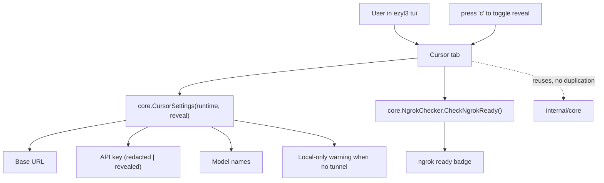

# Cursor TUI View PRD

## Problem Statement

Every real failure a user hit while connecting `ezyl3` to Cursor this cycle came
back to the same gap: **the tool never told them, in one place, what to put into
Cursor and why it might not work.** The fixes landed at the CLI level —
`cursor settings --reveal-key`, the local-only HTTPS warning, the ngrok readiness
preflight, the `litellm-auto` router — but the TUI, which is the surface a user
is most likely to sit in, exposes none of it.

The current TUI (`internal/tui/tui.go`) is a tabbed dashboard:
`Overview | Profile | Services | Models | Doctor | Logs`. It shows setup
progress, service controls, model tiers, doctor checks, and a log preview. It
does **not** show the Cursor base URL, the API key, the model names to paste, the
local-only warning, or ngrok readiness. So a user in the TUI still has to drop to
the CLI (`ezyl3 cursor settings --reveal-key`) and already know the localhost and
quoted-key traps to connect Cursor — exactly the knowledge they lack.

## Solution

Add a **Cursor** tab to the TUI that consolidates everything needed to connect
Cursor into one screen, by reusing the existing, hardened `core` functions so
behavior matches the CLI exactly (no logic duplication, no drift):

- **Base URL** — from `core.CursorSettings`.
- **API key** — redacted (`set`/`empty`) by default; revealed on an explicit
  keypress, printing the clean unquoted master key.
- **Model names** — the five Cursor picker names, noting `litellm-auto` is the
  router.
- **Local-only warning** — when the profile has no tunnel, a prominent warning
  that Cursor cannot use a `127.0.0.1` URL and how to fix it.
- **ngrok readiness** — a badge reflecting `core.DefaultNgrokChecker`, so a user
  setting up a tunnel sees whether ngrok is installed/configured.

Scope is deliberately the Cursor tab only. The broader visual redesign
(responsive `WindowSizeMsg` sizing, bordered panels, adaptive colors) is a
separate future phase and is out of scope here, so this change stays additive,
low-risk, and testable at the model/state layer.

## Architecture

## User Stories

1. As a Cursor user in the TUI, I want a Cursor tab that shows the base URL and
   model names, so that I can connect Cursor without dropping to the CLI.
2. As a Cursor user, I want the API key redacted by default in the Cursor tab, so
   that a screenshot or screen-share does not leak it.
3. As a Cursor user, I want to reveal the API key with a keypress, so that I can
   read the exact value to paste without hunting through `.env`.
4. As a Cursor user, I want the revealed key to be the clean, unquoted value, so
   that I do not paste quotes and hit the misleading `No connected db.` error.
5. As a Cursor user on a local-only profile, I want the Cursor tab to warn that
   Cursor cannot use a localhost URL and tell me how to add a tunnel, so that I do
   not waste time pasting a URL that can never work.
6. As a Cursor user setting up a tunnel, I want the Cursor tab to show whether
   ngrok is installed and configured, so that I can fix ngrok before relying on
   the tunnel.
7. As a Cursor user, I want the Cursor tab to refresh with the existing refresh
   key, so that it reflects the current profile state after I change things.
8. As a developer, I want the Cursor tab to consume existing `core` functions
   rather than reimplement settings logic, so that TUI and CLI never diverge.

## Implementation Decisions

- Add a `cursorTab` constant and a `"Cursor"` entry to the `tabs` slice in
  `internal/tui/tui.go`. Place it directly after `Overview` (it is the primary
  reason a new user opens the TUI). Renumber the iota-based tab constants
  accordingly; all tab dispatch is centralized in `renderMain`, so this is a
  contained change.
- Add a structured `core` accessor as the single source of truth. Introduce
  `core.CursorInfo` (fields: `BaseURL string`, `MasterKey string`, `LocalOnly
  bool`, `Models []string`) and `core.CursorSettingsInfo(runtime) (CursorInfo,
  error)`. Refactor the existing `core.CursorSettings(runtime, reveal)` to format
  its string *from* `CursorInfo`, so CLI output stays byte-identical (guarded by
  the existing CursorSettings tests) and the TUI consumes structured fields
  rather than parsing formatted text. `MasterKey` holds the clean unquoted key;
  callers decide whether to redact.
- The TUI Cursor tab renders from `CursorInfo`: base URL, the model names, the
  local-only warning when `LocalOnly` is true, and the API key redacted to `set`/
  `empty` unless `model.reveal` is true (in which case it prints
  `info.MasterKey`). Never store the cleartext key in model state; read it from
  `CursorInfo` at render time only when revealing.
- Add a reveal toggle key (`c`) to the `keyMap`, enabled only when
  `activeTab == cursorTab` (mirroring how `start`/`stop`/`restart` are gated to
  the services tab). Pressing it flips `model.reveal`. Default is redacted.
- Add ngrok readiness via the injectable checker. Extend the TUI `dependencies`
  struct with a `ngrok func() error` (defaulting to
  `core.DefaultNgrokChecker{}.CheckNgrokReady`) so tests inject a fake and never
  invoke real ngrok. Render a badge: ready, or the first line of the checker's
  error. Only show the badge for tunneled profiles (a local-only profile does not
  need ngrok), consistent with the doctor check.
- Compute reveal/ngrok state in `refresh()` or at render time as appropriate, but
  the revealed key must only be produced when `model.reveal` is true; never hold
  the cleartext key in model state when redacted.
- Keep the footer/help line accurate: when on the Cursor tab, surface the reveal
  key in `ShortHelp`/`FullHelp` the way service keys are surfaced on the services
  tab.
- Do not change `CursorSettings`'s signature or behavior; it already takes
  `(runtime, reveal)` and is covered by tests. If a structured accessor is added,
  it must be additive and separately tested.

## Testing Decisions

- Tests assert model/state and rendered-string behavior, not terminal styling.
  The TUI alt-screen cannot be verified headlessly; rendering correctness is a
  required manual check (run `ezyl3 tui`, open the Cursor tab).
- Add TUI tests using a fake runtime fixture (profile + `.env`) that assert:
  - the Cursor tab renders the base URL and the five model names;
  - the API key is redacted (`set`) by default and the raw key value does not
    appear;
  - after the reveal toggle, the clean unquoted key appears and is not wrapped in
    quotes;
  - a local-only profile shows the warning; a tunneled profile does not;
  - the ngrok badge reflects an injected fake checker (ready vs. failing) and is
    absent for local-only profiles;
  - the reveal key is gated to the Cursor tab (no effect on other tabs).
- Reuse the existing `core` tests for `CursorSettings`; do not duplicate its
  assertions in the TUI layer beyond what the tab surface needs.
- Required verification command: `go test ./...`, plus `gofmt -l`, `go vet`, and
  `go build ./...` (the standard gate in `AGENTS.md`).
- Manual verification: run `ezyl3 tui` against a real managed profile, confirm the
  Cursor tab renders cleanly, reveal toggles the key, and the local-only warning
  appears for a local-only profile.

## Out of Scope

- The broader TUI visual redesign: responsive `WindowSizeMsg` sizing, bordered
  panels, adaptive light/dark colors, tab-strip restyling. Separate phase.
- Copying the key to the system clipboard. Reveal-to-read only; clipboard
  integration is a possible later addition.
- Editing Cursor's settings files directly (still explicitly out of scope
  product-wide).
- Any change to CLI `cursor settings` behavior; this phase only surfaces existing
  behavior in the TUI.
- Live service control changes beyond what already exists on the Services tab.

## Further Notes

- This is the first feature to follow the `AGENTS.md` pipeline end to end:
  PRD (this doc) → plan in `docs/plans/` → one PR via the worktree flow.
- The injectable-dependency pattern (`dependencies` struct in `tui.go`) already
  exists for `doctor`/`services`/`usage`; the ngrok checker follows the same
  shape, keeping the TUI testable without touching the system.
- The reveal-key UX intentionally matches the CLI's opt-in model: redacted
  everywhere by default, revealed only on explicit action, so the secret-handling
  guarantee in `AGENTS.md` holds in the TUI too.
