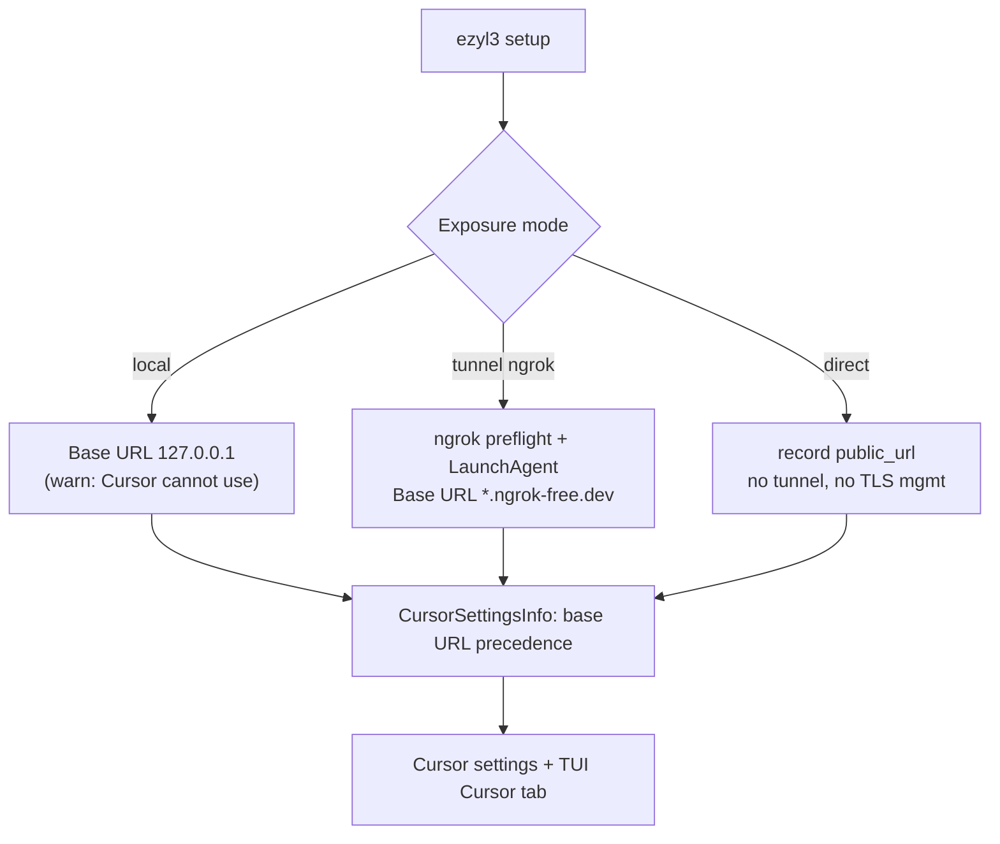

# Optional Tunnel / Direct Public HTTPS PRD

## Problem Statement

`ezyl3` treats an ngrok tunnel as the only way to expose the proxy to Cursor.
That conflates a *requirement* ("Cursor needs a public HTTPS base URL that reaches
the proxy") with one *implementation* (run ngrok). The code bakes ngrok in:
`Profile.TunnelProvider` is hardcoded to `"ngrok"`, `DetectNgrokDomain` is the
only route to a public URL, the setup preflight insists on a working ngrok, and
every warning says "configure an ngrok tunnel."

This is wrong for a real and common case: a proxy already sitting behind a public
HTTPS endpoint — a reverse proxy (Caddy/nginx), a cloud load balancer, Tailscale
Funnel, or `cloudflared` — does not need ezyl3 to run any tunnel at all. The user
already has `https://llm.example.com/v1`; ezyl3 should simply *record and use* it.
Forcing ngrok in that case is a bug.

There are three distinct exposure scenarios; ngrok is one:

| Exposure | How the public HTTPS URL exists | ezyl3's role |
|---|---|---|
| **tunnel** | ezyl3 runs ngrok → `*.ngrok-free.dev` | runs + manages the tunnel |
| **direct** | proxy is already behind a public HTTPS endpoint the user owns | records the URL; does NOT manage TLS or servers |
| **local** | none | unusable with Cursor (correctly warned) |

## Solution

Make the tunnel optional by modeling **exposure** as a first-class concept with
three modes (`local`, `tunnel`, `direct`), and let a `direct` profile carry a
user-supplied public HTTPS URL that ezyl3 records and uses for Cursor settings.
ngrok becomes one implementation of the `tunnel` mode, not a universal
requirement; its readiness preflight fires only for the ngrok tunnel path.

Scope is deliberately narrow and macOS-only:

- ezyl3 **records** a public URL for `direct`; it does **not** issue TLS certs,
  generate reverse-proxy config, or provision servers. TLS termination is the
  user's responsibility (their Caddy/nginx/LB forwards to `127.0.0.1:<port>`).
- The proxy keeps binding `127.0.0.1` — no bind change. A `direct` profile assumes
  the user's reverse proxy on the same host forwards to it.
- This PRD **names** concepts so future work stays possible (multiple tunnel
  providers; non-Cursor harnesses that can use a local URL; Linux/systemd) but
  builds none of that machinery. `tunnel_provider` stays a string; ngrok is the
  only implemented provider.

Explicitly deferred to later milestones (each gets its own PRD): Linux/systemd
support, additional tunnel providers (cloudflared, zrok), and non-Cursor client
harnesses.

## Architecture

## User Stories

1. As a user whose proxy is already behind public HTTPS, I want to give ezyl3 that
   URL instead of an ngrok domain, so that I do not run a tunnel I do not need.
2. As that user, I want `ezyl3 setup` to NOT require ngrok when I supply a public
   URL, so that setup does not fail on a missing tunnel I am not using.
3. As a laptop user without a public endpoint, I want the ngrok tunnel path to keep
   working exactly as today, so that nothing regresses.
4. As any user, I want `cursor settings` and the TUI Cursor tab to show the correct
   base URL for my exposure mode, so that I paste the right thing into Cursor.
5. As a user, I want a clear explanation of the three exposure scenarios, so that I
   pick the right one for a laptop vs. a server-fronted deployment.
6. As a user supplying a public URL, I want ezyl3 to reject a non-HTTPS or
   localhost URL, so that I do not configure something Cursor cannot use.
7. As a developer, I want exposure modeled as data (not hardcoded to ngrok), so
   that future tunnel providers and harnesses are possible without a rewrite.

## Implementation Decisions

- **Schema:** add an exposure notion to `Profile`. Introduce
  `ExposureMode string` with constants `ExposureLocal = "local"`,
  `ExposureTunnel = "tunnel"`, `ExposureDirect = "direct"`, and a
  `PublicURL string` (`json:"public_url,omitempty"`) for the `direct` mode. Keep
  the existing `Domain` (ngrok) and `TunnelProvider` fields. For backward
  compatibility, a loaded profile with no `ExposureMode` is inferred:
  non-empty `Domain` → `tunnel`; otherwise `local`. `TunnelProvider` stays a free
  string defaulting to `ngrok`; document ngrok as the only implemented provider.
- **Base-URL precedence** (single source of truth in `core.CursorSettingsInfo`):
  explicit `PublicURL` (direct) → ngrok `Domain` (tunnel) → `http://127.0.0.1:<port>/v1`
  (local). `LocalOnly` is true only in the local case. The local-only warning is
  unchanged; a `direct` profile is not local-only and shows no warning.
- **Setup flags:** add `--public-url <https url>` as an alternative to `--domain`.
  Supplying both is an error. `--public-url` selects `direct`; `--domain` selects
  `tunnel`; neither selects `local`.
- **ngrok preflight scope:** the existing `NgrokChecker` preflight runs ONLY on
  the `tunnel`+ngrok path. A `direct` or `local` profile never triggers it. This
  is the direct fix for the over-strict check.
- **LaunchAgents:** the ngrok LaunchAgent is written only for `tunnel` mode (as
  today, gated on a domain). `direct` and `local` write only the litellm agent.
- **Validation:** `--public-url` must parse as an absolute URL with scheme
  `https` and a non-empty host that is not `localhost`/loopback; otherwise fail
  fast with a clear message. Normalize to ensure the `/v1` suffix is presented
  consistently in Cursor settings (record the base, format the `/v1` URL the same
  way ngrok/local do).
- **Doctor / warnings:** reframe ngrok-specific copy to the requirement:
  "Cursor needs a public HTTPS base URL — via an ngrok tunnel (`--domain`) or a
  public HTTPS endpoint that reaches the proxy (`--public-url`)." The ngrok
  readiness check appears only for `tunnel` profiles. For a `direct` profile,
  doctor HTTP-probes the public URL's `/health/liveliness` endpoint (consistent
  with the existing ngrok tunnel-liveliness check) and reports reachable / not.
- **Naming, not machinery:** do NOT add a tunnel-provider interface/registry, a
  second provider, Linux service writers, or non-Cursor harness handling. The
  schema and copy should merely not preclude them.

## Testing Decisions

- Unit-test `CursorSettingsInfo` base-URL precedence across all three modes:
  direct (public URL), tunnel (ngrok domain), local (127.0.0.1 + `LocalOnly`),
  plus the backward-compat inference for profiles lacking `ExposureMode`.
- Unit-test public-URL validation: accept `https://host/...`; reject `http://`,
  bare host, `localhost`, and loopback IPs.
- Setup tests (fake deps): `--public-url` creates a `direct` profile, writes NO
  ngrok LaunchAgent, and does NOT invoke the ngrok checker; `--domain` keeps
  today's tunnel behavior including preflight; `--public-url` + `--domain` errors;
  neither yields `local`.
- CLI test: `cursor settings` shows the public URL for a direct profile with no
  local-only warning; the existing redaction/reveal behavior is unchanged.
- Confirm existing ngrok/tunnel tests still pass unchanged (no regression to the
  laptop path).
- Required gate: `go build ./... && go test ./... && gofmt -l . && go vet ./...`.
- The TUI Cursor tab already renders from `CursorSettingsInfo`, so direct mode
  flows through automatically; add a TUI test asserting a direct profile shows the
  public URL and no local-only warning. Live alt-screen check remains a manual
  step.

## Out of Scope

- Issuing/renewing TLS certificates, generating reverse-proxy (Caddy/nginx)
  config, or provisioning/deploying any server.
- Changing the proxy bind address away from `127.0.0.1`.
- Linux/systemd support (separate milestone + PRD).
- Additional tunnel providers — cloudflared, zrok, etc. (`tunnel_provider` stays a
  documented single-implementation string).
- Non-Cursor client harnesses and a "local LLM, no HTTPS needed" client path
  (named as future direction; not built).
- Auto-detecting an existing public endpoint; the user supplies it explicitly.

## Further Notes

- This corrects a core mental-model bug: the requirement is "public HTTPS reaching
  the proxy," and ngrok is one way to get it. The product had hardcoded the means.
- The design intentionally separates four orthogonal axes — exposure, tunnel
  provider, platform/supervision, and client harness — but only *exposure* is
  built out now. The others are named so the later milestones (Linux/systemd,
  more providers, more harnesses) are additive rather than rewrites.
- `CursorSettingsInfo` (added in the Cursor TUI work) is the single base-URL
  source of truth, so both the CLI and the TUI pick up direct mode for free.
